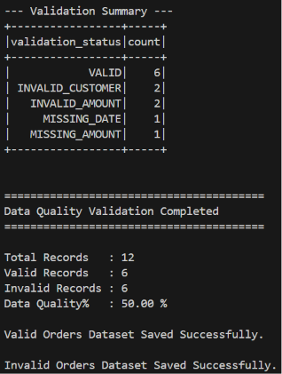

# Data Quality & Validation Pipeline

## Project Overview

A local PySpark ETL (Extract, Transform, Load) data processing pipeline designed to enforce data quality rules and validate incoming order records. The application inspects incoming order datasets for missing fields and rule violations, categorizes failure reasons with explicit status tags, isolates clean records from rejected records, calculates dataset health compliance percentages, and routes outputs to separate valid and invalid storage directories.

---

## Technologies

- Python 3.14
- Apache Spark 4.2
- PySpark 4.2

---

## Features

- **Multi-Attribute Rule Validation:** Enforces non-null checks across key transaction attributes (`order_id`, `customer_id`, `amount`, `order_date`) and validates domain rules (`amount > 0`).
- **Granular Status Flagging:** Classifies each record with explicit validation statuses (`INVALID_ORDER`, `INVALID_CUSTOMER`, `MISSING_AMOUNT`, `INVALID_AMOUNT`, `MISSING_DATE`, `VALID`).
- **Record Routing:** Separates dataset records into valid and rejected DataFrames based on boolean validation flags.
- **Data Quality Health Scoring:** Programmatically computes dataset compliance percentages (`Data Quality % = Valid Records / Total Records * 100`).
- **Error Frequency Aggregation:** Groups and counts failure types to provide immediate visibility into common data ingestion anomalies.
- **Dual-Target Output Export:** Writes valid records to `output/valid_orders/` and rejected records to `output/invalid_orders/` as multi-part Spark CSV directories.

---

## Project Structure

```text
11-data-quality-validation-pipeline/
├── data/
│   └── orders.csv
├── output/
│   ├── invalid_orders/
│   └── valid_orders/
├── screenshots/
│   ├── output1.png
│   ├── output2.png
│   ├── output3.png
│   └── output4.png
├── src/
│   └── main.py
├── .gitignore
├── LICENSE
├── README.md
└── requirements.txt
```

---

## ETL Process

- **Extract**

Initializes a local SparkSession using `local[*]` execution.
Ingests data/orders.csv with header parsing and schema inference enabled.

- **Transform**

Date Conversion: Casts order_date string representations into native DateType fields using to_date().
Boolean Rule Evaluation: Applies multi-condition checks via when() to assign a boolean is_valid flag.
Failure Classification: Uses chained PySpark `when()` conditions and `otherwise()` to assign specific failure reasons or mark records as `VALID`.
Data Routing: Filters rows into two distinct DataFrames: valid_order_df (is_valid == True) and invalid_order_df (is_valid == False).
Summary Aggregation & KPI Calculation: Groups records by validation_status to compute failure counts and evaluates overall data quality percentages.

- **Load**

Prints intermediate schemas, categorized DataFrames, and top-level data health metrics to the console.
Exports valid transactions to output/valid_orders/ and quarantined records to output/invalid_orders/ as header-enabled Spark CSV directories.

---

## Sample Output



---

## What I Learned

- Build multi-condition validation rules using `&` and `isNotNull()`.
- Implement failure-reason classification using chained PySpark `when()` and `otherwise()`.
- Separate valid and rejected records using DataFrame `.filter()`.
- Generate data-quality metrics by combining `.count()`, `.groupBy()`, and aggregation logic.
- Manage multiple output destinations within a single PySpark ETL pipeline.

--- 

## Future Improvements

- Automated Alerting Thresholds: Trigger pipeline notifications or fail-fast exit codes if overall Data Quality drops below a set threshold (e.g., < 95%).

- Schema Definition Enforcers: Enforce explicit StructType schemas to capture malformed data types during ingestion before transformations run.

- Dead-Letter Queue (DLQ) Integration: Route invalid records directly to cloud object storage quarantine zones (e.g., AWS S3 / Azure Data Lake) for auditing.

- Parquet Export: Migrate output directory storage from multi-part CSV directories to optimized columnar Parquet formats.

---

## Skills Demonstrated

- Data Governance & Quality Engineering: Validation Rule Design, Record Routing, Failure Tagging, Health Metric Calculation.

- PySpark Transformation APIs: Multi-condition when(), isNotNull(), to_date(), .filter(), .groupBy().

- ETL Architecture & Storage Routing: Rejected-record routing, dual-target directory exports, and batch data-quality monitoring.